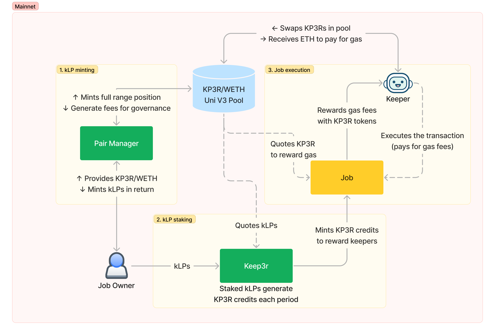
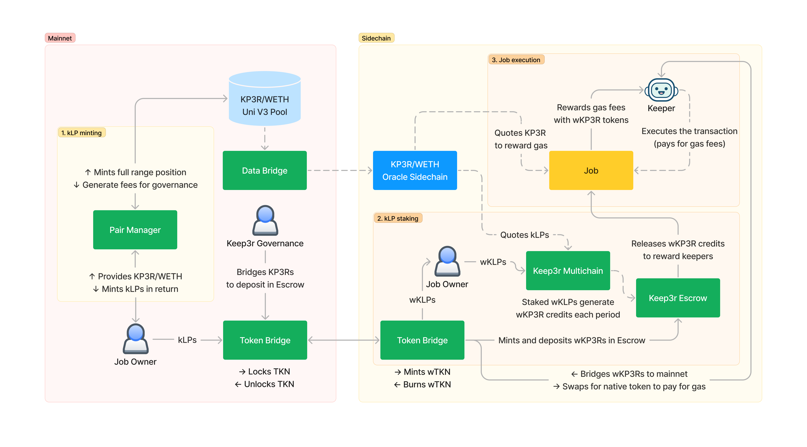

# Introduction

_These docs are in active development by the Keep3r community._

The Keep3r Network is a decentralized network for projects that need external devops, and for external teams to find keeper jobs.

## [Keepers](core/keepers)

A Keeper is the term used to refer to an external address that executes a job. This can be as simplistic as calling a transaction, or as complex as requiring extensive off-chain logic. The scope of Keep3r network is not to manage these jobs themselves, but to allow contracts to register as jobs for keepers, and keepers to register themselves as available to perform jobs. It is up to the individual keeper to set up their DevOps and infrastructure and create their own rules based on what transactions they deem profitable.

## [Jobs](core/jobs)

A Job is the term used to refer to a smart contract that wishes an external entity to perform an action. They would like the action to be performed in "good will" and not have a malicious result. For this reason they register as a job, and keepers can then execute on their contract. Both relying on the Keep3r ecosystem to mediate in the event of a dispute.

## [Credits](tokenomics/job-payment-mechanisms/credit-mining)

Credits are used to pay keepers for their work. A job can either top up your credits [with tokens](tokenomics/job-payment-mechanisms/token-payments.md), or by mining credits with time by [staking liquidity](tokenomics/job-payment-mechanisms/credit-mining.md).

## [Sidechain](sidechain/)

The Keep3r Network also supports staking in Optimism and Polygon, where the payment rewards are calculated by `$USD / gasUnit` to improve keepers' profitability, and reduce the exposure to fluctuating gas prices.

#### Mainnet environment
| Chain (`chainId`) | Implementation | Address |
| -------- | -------- | -------- |
| Ethereum (`1`)    | Keep3r     | `0xeb02addCfD8B773A5FFA6B9d1FE99c566f8c44CC`     |
| Optimism (`10`)    | Keep3rSidechain     | `0x745a50320B6eB8FF281f1664Fc6713991661B129`     |
| Polygon (`137`)    | Keep3rSidechain     | `TBD`     |

#### Testnet environment
| Chain (`chainId`) | Implementation | Address |
| -------- | -------- | -------- |
| Goerli (`5`)    | Keep3rForTestnet     | `0x85063437C02Ba7F4f82F898859e4992380DEd3bb`     |
| Goerli (`5`)    | JobForTest     | `0xa2c7A15FFc02e00cdeedBba56c41dAaed84f8734`     |
| OPGoerli (`420`)    | Keep3rSidechainForTestnet     | `0x85063437C02Ba7F4f82F898859e4992380DEd3bb`     |
| OPGoerli (`420`)    | JobRatedForTest     | `0x9abB5cfF47b9F604351a6f0730d9fe39Fb620B2b`     |

> ForTestnet implementations allow instant bonding and unbonding, and use a free-to-mint ERC20 as KP3Rv1.
